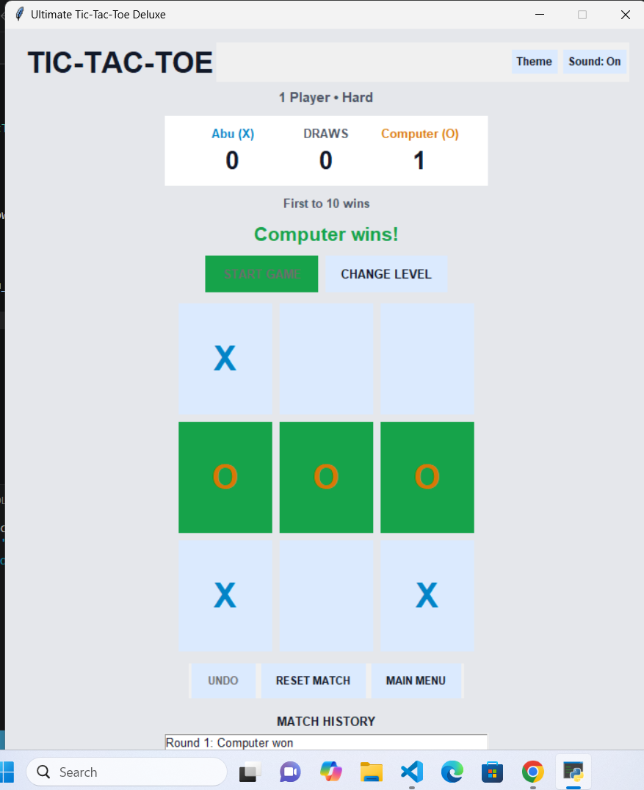

# Ultimate Tic-Tac-Toe Deluxe

A polished desktop Tic-Tac-Toe game built with Python and Tkinter.

## Screenshot



## Features

- One-player and two-player modes
- Easy, Medium, and Hard computer difficulty
- Hard mode uses the Minimax algorithm
- Choose whether to play as X or O
- Player-name support
- First-to-3, first-to-5, or first-to-10 match targets
- Automatic next-round reset while keeping the match score
- Live scoreboard
- Recent match history
- Undo support in two-player mode
- Sound on/off
- Light and dark themes
- Keyboard controls using keys 1–9
- Saved settings and lifetime scores
- Change Level and Main Menu controls

## Project structure

```text
Ultimate-TicTacToe-Deluxe/
├── main.py
├── gui.py
├── game.py
├── ai.py
├── settings.py
├── sounds.py
├── storage.py
├── scores.json
├── requirements.txt
├── .gitignore
├── LICENSE
├── screenshots/
│   └── gameplay.png
└── assets/
    └── README.md
```

## Requirements

- Python 3.10 or newer
- Tkinter

No third-party Python package is required.

## How to run

Clone the repository:

```bash
git clone https://github.com/YOUR-USERNAME/Ultimate-TicTacToe-Deluxe.git
```

Open the project folder:

```bash
cd Ultimate-TicTacToe-Deluxe
```

Run the game:

```bash
python main.py
```

On some Windows computers, use:

```bash
py main.py
```

## Keyboard controls

The number keys correspond to the board:

```text
1 2 3
4 5 6
7 8 9
```

Press `Esc` to return to the settings screen.

## Computer difficulty

- **Easy:** chooses random available squares.
- **Medium:** tries to win, blocks the player, and prefers useful squares.
- **Hard:** uses Minimax and is designed to be very difficult to defeat.

## Main files

- `main.py` starts the program.
- `gui.py` contains the Tkinter interface and match control.
- `game.py` contains board rules and winner detection.
- `ai.py` contains the computer-player algorithms.
- `settings.py` contains themes and constants.
- `storage.py` saves settings and lifetime scores.
- `sounds.py` manages simple sound effects.

## Building a Windows executable

Install PyInstaller:

```bash
pip install pyinstaller
```

Build the executable:

```bash
pyinstaller --onefile --windowed --name TicTacToeDeluxe main.py
```

The executable will appear inside the `dist` folder.

## Author

**Tajudeen Busari**

## License

This project is licensed under the MIT License.
